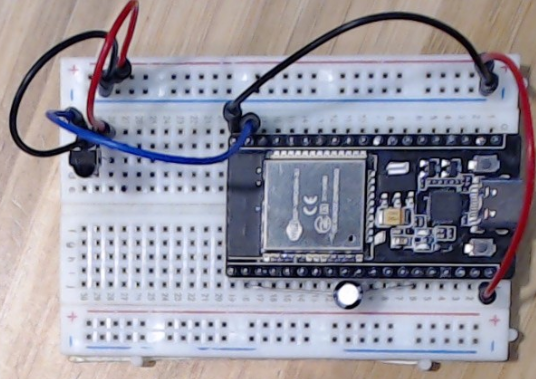

# Thermostat

Objective:

Create thermostat for electric fireplace, controlled using ESP32 and mimicing IR remote

Commit state:

Receives and prints IR readings in hex format to serial monitor using IR receiver.

Parts:

- 1x ESP-WROOM-32
- 5x breadboard cables
- 1x IR Receiver (TSOP38238)
- 1x 10uF cap = EN, GND (For quick sketch changes)

Packages:

IRremoteESP8266
